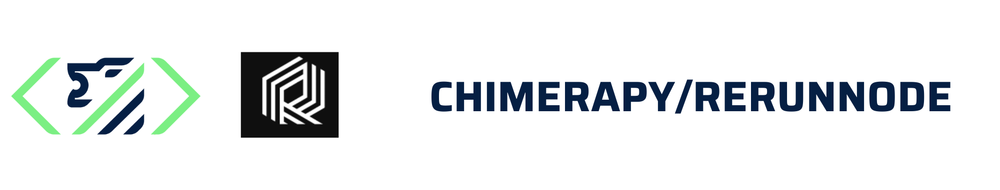

<p align="center">
  <a href="https://github.com/ChimeraPy/Orchestrator"></a>
</p>
<p align="center">
    <em>proof of concept implementation of a [rerun](https://rerun.io) viewer to log data with a ChimeraPy node</em>
</p>
<p align="center">
</p>


ChimeraPy is a Scientific, Distributed Computing Framework for Real-time Multimodal Data Retrieval and Processing. This is a proof of concept implementation of a [rerun](https://rerun.io) viewer to log data with a ChimeraPy node.

## Installation
1. Install the chimerapy [Engine](https://github.com/ChimeraPy/Engine), [Orchestrator](https://github.com/ChimeraPy/Orchestrator), [Pipelines](https://github.com/ChimeraPy/Pipelines).
2. Install the package
```bash
$ git clone https://github.com/ChimeraPy/RerunNode
$ pip install .[test]
```

## Usage
To Do

## Contributing
Contributions are welcomed! Our [Developer Documentation](https://chimerapy.readthedocs.io/en/latest/developer/index.html) should provide more details in how ChimeraPy works and what is in current development.

## License
[ChimeraPy](https://github.com/ChimeraPy) and [ChimeraPy/Orchestrator](https://github.com/ChimeraPy/Orchestrator) uses the GNU GENERAL PUBLIC LICENSE, as found in [LICENSE](./LICENSE) file. Rerun is released under the dual license of MIT and Apache 2.0, as found in [LICENSE-MIT](https://github.com/rerun-io/rerun/blob/main/LICENSE-MIT) and [LICENSE-APACHE](.https://github.com/rerun-io/rerun/blob/main/LICENSE-APACHE) file.

## Funding Info
This project is supported by the [National Science Foundation](https://www.nsf.gov/) under AI Institute  Grant No. [DRL-2112635](https://www.nsf.gov/awardsearch/showAward?AWD_ID=2112635&HistoricalAwards=false).
